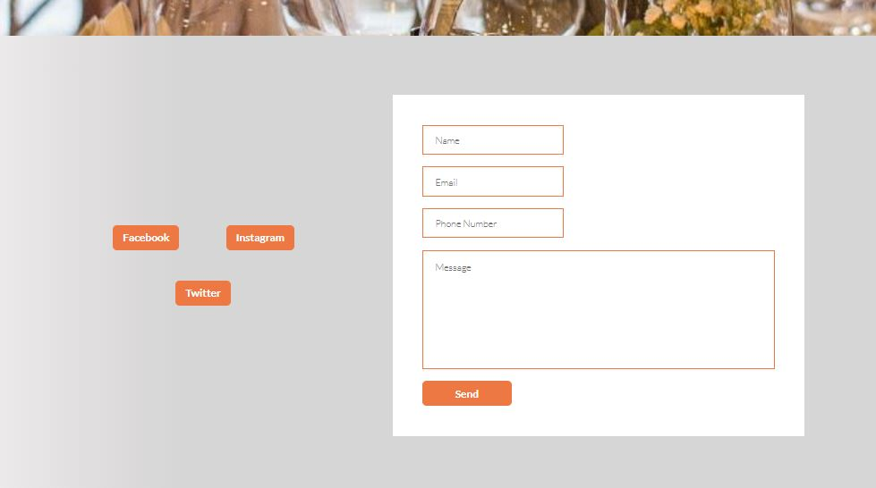

<b><h2>The Barn Organic Restaurant</h2></b>

The Barn Organic Restaurant is a family restaurant located just outside Dublin city. The restaurant has been opened for over 40 years and has just recently gone through a major update not only to the menu but to the restaurant itself too. This site hopes to attract people to the restaurant by enticing them to try locally produced organic food and drinks. 

<h3>Features</h3>

<h4>•	Navigation bar</h4>

       •	Featured on all three pages, the full responsive navigation bar includes links to the Logo, Home page, restaurant menu page and contact page. The navigation bar is identical across each page to allow for easy navigation.

       •	This section will allow the user to easily navigate from page to page across all devices without having to revert back to the previous page via the ‘back’ button.

      

<h4>•	The landing page</h4>

       •	The landing page consist of a welcome note from the restaurant that explains how the restaurant has been serving it’s customers for over 40 years and will continue to do so but has adapted and changed inline with how its customers are expecting. 

       •	The landing page also displays the opening hours of the restaurant

    

<h4>•	The menu page</h4>

       •	The menu pages display’s the restaurant’s menu in a simple way. The page highlights the restaurants signature dishes and what customers can expect.  

    

<h4>•	The contact page</h4>

       •	The contact pages consist of a form that customers can fill out in order to get in contact with the restaurant to make bookings to make amendments to bookings

       •	The form allows customers to input their name, email, phone number and to write a message as to why they are contacting the restaurant. 

       •	The contact page also includes links to the restaurants social media accounts which allows customers to connect with the restaurant there also 

           

<h3>Testing</h3>

Validator Testing

HTML

No errors were returned when passing through the official W3C validator

CSS

No errors were found when passing through the official (Jigsaw) validator
